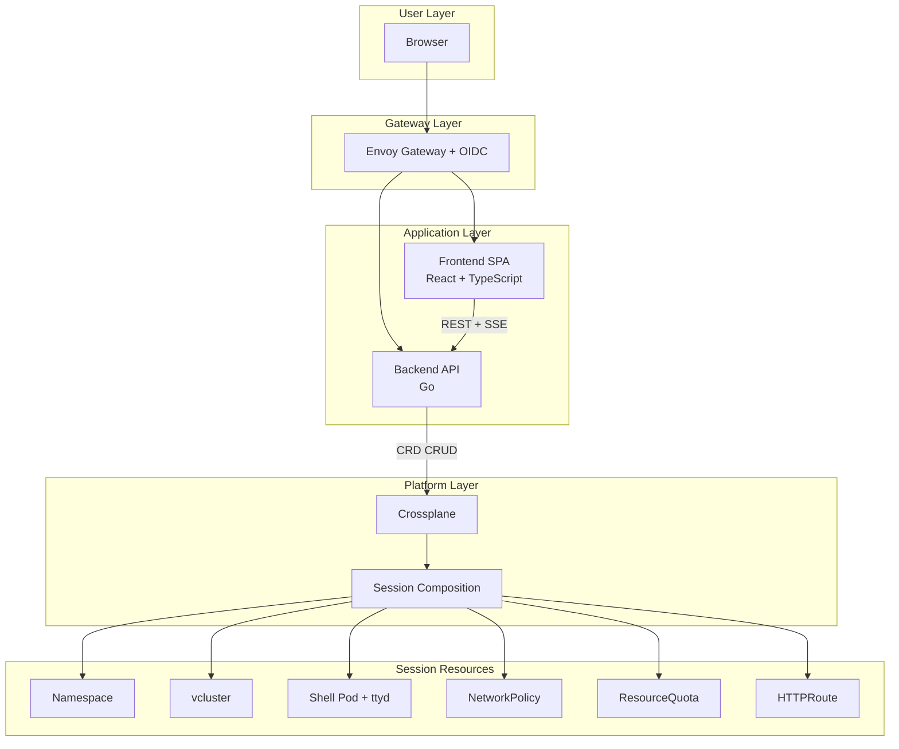

# KubeSandbox

## Demo

Work in progress, URL to come: [https://kubesandbox.com](https://kubesandbox.com)

**On-demand Kubernetes playgrounds with isolated virtual clusters**

KubeSandbox provides ephemeral, self-service Kubernetes environments that spin up in seconds. Each session gets its own virtual cluster (vcluster), web-based terminal, and automatic cleanup — perfect for learning, workshops, demos, and experimentation.

## Motivation

Getting hands-on Kubernetes experience shouldn't require managing permanent infrastructure. Whether you're:

- **Learning Kubernetes** — Experiment without fear of breaking shared clusters
- **Running workshops** — Give each participant their own isolated environment
- **Demoing tools** — Spin up a fresh cluster for every presentation
- **Testing configurations** — Try out manifests, operators, or Helm charts in isolation

KubeSandbox solves this by providing instant, time-limited sandboxes with full Kubernetes capabilities — no local setup, no minikube, no cleanup required.

## Features

### Isolated Virtual Clusters

Each session provisions a dedicated [vcluster](https://www.vcluster.com/) — a lightweight virtual cluster running inside the host cluster. This provides true multi-tenancy where users get full cluster-admin access within their sandbox without affecting others.

### Web-Based Terminal

Instant access through a browser-based terminal powered by [ttyd](https://github.com/tsl0922/ttyd). No kubectl installation required — just open the workspace and start interacting with your cluster.

### Real-Time Session Updates

Server-Sent Events (SSE) provide live session status updates. Watch your sandbox provision, become ready, and track its lifecycle without refreshing.

### Automatic Cleanup

Sessions have configurable TTLs (15 minutes to 24 hours). When time expires, Crossplane tears down all associated resources — namespace, vcluster, pods, and network policies.

### Profile-Based Resources

Choose from predefined session profiles:

| Profile | Use Case |
|---------|----------|
| **Starter** | Quick experiments and learning |
| **Standard** | Workshops and typical workloads |
| **Advanced** | Resource-intensive demos and testing |

### Secure by Design

Every session includes:

- **NetworkPolicies** — Restrict traffic to only necessary paths
- **ResourceQuotas** — Prevent resource exhaustion
- **Non-root containers** — Security-first pod security context
- **Seccomp profiles** — Runtime security enforcement

### Seamless Authentication

OIDC integration through Envoy Gateway provides single sign-on. No custom auth logic — just standard enterprise identity flows.

## Architecture



### Component Overview

| Component | Technology | Purpose |
|-----------|-----------|---------|
| **Frontend** | React 19, TypeScript, Vite, Tailwind CSS | User interface for session management |
| **Backend** | Go 1.25, client-go | REST API and SSE stream |
| **Crossplane** | Function-based compositions | Infrastructure orchestration |
| **vcluster** | Helm chart via Crossplane provider | Virtual cluster provisioning |
| **Envoy Gateway** | Gateway API + OIDC | Authentication and routing |

### Session Lifecycle

```
┌─────────────┐     ┌──────────────┐     ┌─────────┐     ┌─────────┐
│   Create    │────▶│ Provisioning │────▶│  Ready  │────▶│ Cleanup │
│  (API call) │     │  (vcluster)  │     │ (Use)   │     │  (TTL)  │
└─────────────┘     └──────────────┘     └─────────┘     └─────────┘
```

1. User creates a session via the frontend
2. Backend creates a `KubeSandboxSession` custom resource
3. Crossplane's composition provisions all resources
4. Shell pod becomes ready, user accesses workspace
5. TTL expires, Crossplane tears down everything

## Project Structure

```
kubesandbox/
├── backend/                    # Go backend API service
│   ├── cmd/                    # Application entrypoint
│   └── internal/
│       ├── api/handlers/       # REST API handlers
│       ├── api/middleware/     # Auth middleware
│       ├── config/             # Configuration
│       ├── kubernetes/         # K8s client and session ops
│       └── models/             # Data models and CRD types
├── frontend/                   # React frontend application
│   └── src/
│       ├── components/         # Reusable UI components
│       ├── context/            # React context providers
│       ├── lib/                # API client and utilities
│       └── pages/              # Route-level page components
├── kubesandbox-charts/         # Helm charts
│   ├── frontend/               # Frontend deployment chart
│   └── kubesandbox-backend/    # Backend deployment chart
├── docs/                       # Documentation
└── Dockerfile                  # Workspace image (ttyd + k8s tools)
```

## Tech Stack

### Frontend

- **React 19** with TypeScript
- **Vite** for fast development and builds
- **Tailwind CSS** for styling
- **Anime.js** for animations
- **Zod** for runtime validation

### Backend

- **Go 1.25**
- **client-go** for Kubernetes API interaction
- Standard library HTTP server
- SSE for real-time updates

### Infrastructure

- **Crossplane** with function-based compositions
- **vcluster** for virtual cluster isolation
- **Envoy Gateway** for authentication and routing
- **Helm** for application deployment

## Custom Resource Definition

Sessions are managed through the `KubeSandboxSession` CRD:

```yaml
apiVersion: platform.kubesandbox.com/v1alpha1
kind: KubeSandboxSession
metadata:
  name: my-session
spec:
  tenantRef: my-tenant
  ownerRef: user@example.com
  profile: standard
  ttlMinutes: 60
  workspaceImage: jurassicjey/ttyd-k8s:ttyd
  resources:
    cpu: 500m
    memory: 512Mi
status:
  phase: Ready
  sessionNamespace: playground-my-session
  vclusterRelease: my-session-vcluster
  workspacePod: shell
  workspaceReady: true
```

## What Gets Provisioned

When you create a session, Crossplane provisions:

| Resource | Purpose |
|----------|---------|
| **Namespace** | Isolated session namespace |
| **ResourceQuota** | Prevents resource exhaustion |
| **vcluster** | Virtual Kubernetes cluster |
| **NetworkPolicy** | Traffic restrictions |
| **Shell Pod** | Web terminal with kubectl |
| **Service** | Exposes shell pod internally |
| **HTTPRoute** | Gateway API routing to workspace |

## License

MIT
