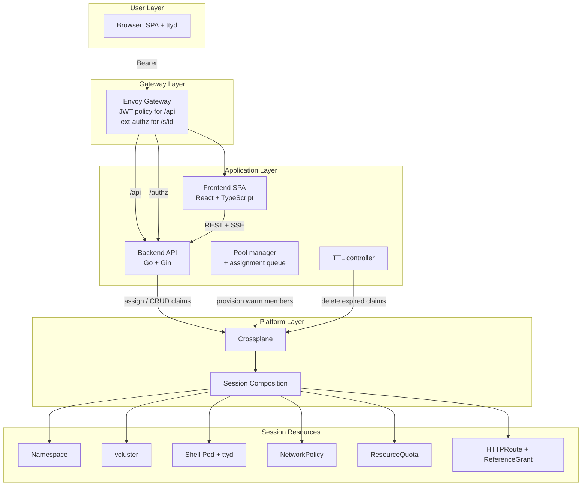

# KubeSandbox

Work in progress, URL to come: [https://kubesandbox.com](https://kubesandbox.com)

**On-demand Kubernetes playgrounds with isolated virtual clusters**

KubeSandbox provides ephemeral, self-service Kubernetes environments. A hot pool
of pre-provisioned sandboxes means a new session is handed over in seconds
instead of waiting minutes for a cold build. Each session gets its own virtual
cluster (vcluster), web-based terminal, and automatic cleanup — perfect for
learning, workshops, demos, and experimentation.

## Motivation

Getting hands-on Kubernetes experience shouldn't require managing permanent infrastructure. Whether you're:

- **Learning Kubernetes** — Experiment without fear of breaking shared clusters
- **Running workshops** — Give each participant their own isolated environment
- **Demoing tools** — Spin up a fresh cluster for every presentation
- **Testing configurations** — Try out manifests, operators, or Helm charts in isolation

KubeSandbox solves this by providing instant, time-limited sandboxes with full Kubernetes capabilities — no local setup, no minikube, no cleanup required.

## Features

### Isolated Virtual Clusters

Each session provisions a dedicated [vcluster](https://www.vcluster.com/) — a lightweight virtual cluster running inside the host cluster. This provides true multi-tenancy where users get full cluster-admin access within their sandbox without affecting others.

### Instant Provisioning via a Hot Pool

A background pool manager keeps a configurable number of sandboxes pre-provisioned and `Ready` at all times. Because every sandbox is identical, any warm one can be handed to any user: `POST /api/sessions` is a metadata-only assignment (sub-second) rather than a cold vcluster boot (which can take minutes). When the pool is momentarily empty, requests join a FIFO queue and are admitted the instant a sandbox becomes free — no synchronous cold build ever blocks a request.

### One Sandbox Per User

Each user has at most **one active sandbox** at a time. This is enforced structurally: at assignment the backend creates a per-owner marker `ConfigMap` whose name is derived deterministically from the user's identity, so the Kubernetes API server rejects a duplicate atomically (no list-then-create race). To start fresh, delete the current sandbox — recreation is available as soon as cleanup releases the marker.

### Web-Based Terminal

Instant access through a browser-based terminal powered by [ttyd](https://github.com/tsl0922/ttyd). No kubectl installation required — just open the workspace and start interacting with your cluster. When the terminal is served from the app's own origin it is embedded in-page; otherwise the app hands off to a new tab.

### Real-Time Session Updates

Server-Sent Events (SSE) provide live session status and live queue-position updates. Watch your sandbox become ready, or watch your place in line advance, without refreshing. The SPA reads SSE with a `fetch` stream (so it can attach a bearer token) and falls back to polling if the stream drops.

### Automatic Cleanup

Sessions have configurable TTLs (15 minutes to 24 hours). A server-side TTL controller in the backend deletes any claim past its expiry every minute; deleting the claim cascades teardown of all associated resources through Crossplane. A backstop sweep CronJob reaps any namespace orphaned by a wedged finalizer.

### Uniform, Fungible Sandboxes

Every sandbox has the same shape (500m CPU / 512Mi memory for the shell pod). Uniformity is what makes the hot pool work — a pre-provisioned member carries no owner until it's assigned, so it can be handed to whoever asks next.

### Secure by Design

Every session includes:

- **NetworkPolicies** — Restrict traffic to only necessary paths
- **ResourceQuotas** — Prevent resource exhaustion
- **Non-root containers** — Security-first pod security context
- **Read-only root filesystem** — Writable area confined to `/tmp`
- **Per-session ownership enforcement** — Only the owner can reach their terminal

### Seamless Authentication

Two auth surfaces, both standards-based. The control API (`/api`) is protected by an Envoy Gateway JWT `SecurityPolicy`; the SPA obtains bearer tokens via its own Authorization Code + PKCE flow. The terminal routes (`/s/{id}`) are protected by a **backend-owned OIDC/PKCE flow** behind Envoy ext-authz — the backend drives login and enforces per-session ownership.

## Architecture


```mermaid
flowchart TB
    subgraph User Layer
        Browser[Browser: SPA + ttyd]
    end

    subgraph Gateway Layer
        Envoy[Envoy Gateway<br/>JWT policy for /api<br/>ext-authz for /s/id]
    end

    subgraph Application Layer
        Frontend[Frontend SPA<br/>React + TypeScript]
        Backend[Backend API<br/>Go + Gin]
        Pool[Pool manager<br/>+ assignment queue]
        TTL[TTL controller]
    end

    subgraph Platform Layer
        Crossplane[Crossplane]
        Composition[Session Composition]
    end

    subgraph Session Resources
        NS[Namespace]
        VCluster[vcluster]
        Shell[Shell Pod + ttyd]
        NP[NetworkPolicy]
        RQ[ResourceQuota]
        Route[HTTPRoute + ReferenceGrant]
    end

    Browser -->|Bearer| Envoy
    Envoy --> Frontend
    Envoy -->|/api| Backend
    Envoy -->|/authz| Backend
    Frontend -->|REST + SSE| Backend
    Backend -->|assign / CRUD claims| Crossplane
    Pool -->|provision warm members| Crossplane
    TTL -->|delete expired claims| Crossplane
    Crossplane --> Composition
    Composition --> NS
    Composition --> VCluster
    Composition --> Shell
    Composition --> NP
    Composition --> RQ
    Composition --> Route
```

### Component Overview

| Component | Technology | Purpose |
|-----------|-----------|---------|
| **Frontend** | React 19, TypeScript, Vite, Tailwind, TanStack Query | User interface for session and queue management |
| **Backend** | Go 1.25, Gin, client-go (dynamic client) | Control API, hot pool, assignment queue, TTL, session OIDC/ext-authz |
| **Crossplane** | Function-based compositions | Infrastructure orchestration |
| **vcluster** | Helm chart via Crossplane provider | Virtual cluster provisioning |
| **Envoy Gateway** | Gateway API + JWT + ext-authz | Authentication and routing |

### Session Lifecycle

```
   pool manager                     user request
   pre-provisions   ┌───────────┐   assigns a warm    ┌─────────┐     ┌─────────┐
   warm members ───▶│  Warm /   │──▶ member (metadata ▶│  Ready  │────▶│ Cleanup │
   (Ready, no owner)│ available │    change, seconds)  │ (owned) │     │  (TTL)  │
                    └───────────┘                      └─────────┘     └─────────┘
                          ▲                                                 │
                          └──────────── refill to target ───────────────────┘
```

1. The pool manager keeps N unclaimed sandboxes provisioned and `Ready`.
2. A user creates a session: the backend atomically reserves the one-per-user marker, then claims a warm member by stamping the owner onto it (`201 Created`). If no member is free, the request is queued (`202 Accepted`, follow `/api/queue/events`).
3. The user opens the terminal; ext-authz verifies ownership and routes to ttyd.
4. The TTL controller deletes the claim at expiry; Crossplane cascades teardown, and the marker is released so the user can create again.

## Project Structure

```
kubesandbox/
├── backend/                    # Go backend control service
│   ├── cmd/server/            # Application entrypoint
│   └── internal/
│       ├── api/handlers/       # REST, SSE, authz, and OIDC-callback handlers
│       ├── api/middleware/     # Identity middleware (X-User-* headers)
│       ├── auth/               # OIDC/PKCE + signed session/state cookies
│       ├── config/             # Configuration
│       ├── kubernetes/         # Claim CRUD, hot pool, assignment, queue, TTL, markers
│       └── models/             # Data models and CRD coordinates
├── frontend/                   # React frontend application
│   └── src/
│       ├── components/         # Reusable UI components
│       ├── context/            # React context providers
│       ├── hooks/              # Data + SSE hooks (sessions, queue, events)
│       ├── lib/                # API client, auth, Zod schemas
│       └── pages/              # Route-level page components
├── kubesandbox-charts/         # Helm charts
│   ├── frontend/               # Frontend deployment chart
│   └── kubesandbox-backend/    # Backend chart (+ XRD, composition, policies, sweep)
├── docs/                       # Architecture, auth, and implementation docs
└── Dockerfile                  # Workspace image (ttyd + k8s tools)
```

## Tech Stack

### Frontend

- **React 19** with TypeScript
- **Vite** for fast development and builds
- **Tailwind CSS** with shadcn-style UI primitives
- **TanStack Query** for server-state caching
- **oidc-client-ts** for Authorization Code + PKCE
- **Zod** for runtime validation
- **Anime.js** for light animation polish

### Backend

- **Go 1.25**
- **Gin** HTTP framework
- **client-go** dynamic client for Kubernetes API interaction
- In-process **hot warm-pool manager**, **assignment queue**, and **TTL controller**
- Backend-owned **OIDC/PKCE** login + **ext-authz** ownership checks
- SSE for real-time session and queue updates

### Infrastructure

- **Crossplane** with function-based compositions
- **vcluster** for virtual cluster isolation
- **Envoy Gateway** for authentication and routing
- **Helm** for application deployment

## Custom Resource Definition

Sessions are managed through the `KubeSandboxSession` claim (composite
`XKubeSandboxSession`). `tenantRef`/`ownerRef` are empty on unclaimed warm-pool
members and are set by the backend at assignment:

```yaml
apiVersion: platform.kubesandbox.com/v1alpha1
kind: KubeSandboxSession
metadata:
  name: s-pool-1a2b3c4d5e
spec:
  tenantRef: ""            # set to the owner subject at assignment
  ownerRef: ""             # set to the owner subject at assignment
  ttlMinutes: 60
  expiresAt: ""            # absolute expiry, set by the backend at assignment
  workspaceImage: jurassicjey/ttyd-k8s:ttyd
  resources:
    cpu: 500m
    memory: 512Mi
status:
  phase: Ready
  sessionNamespace: playground-s-pool-1a2b3c4d5e
  vclusterRelease: vcluster
  workspacePod: shell
  workspaceReady: true
  expiresAt: "2026-07-02T18:00:00Z"
```

## What Gets Provisioned

When a session is provisioned, Crossplane's composition creates:

| Resource | Purpose |
|----------|---------|
| **Namespace** | Isolated session namespace `{claim-ns}-{claim-name}` |
| **ResourceQuota** | Prevents resource exhaustion |
| **vcluster** | Virtual Kubernetes cluster (Helm Release) |
| **NetworkPolicy** | Traffic restrictions |
| **Shell Pod** | Web terminal (ttyd) with kubectl scoped to the vcluster |
| **Service** | Exposes the shell pod internally |
| **HTTPRoute** | Gateway API routing to the workspace (in the shared `kubesandbox` namespace) |
| **ReferenceGrant** | Permits the cross-namespace HTTPRoute → shell Service backendRef |

## Documentation

See [`docs/`](./docs) for the full documentation index. It's split into
[`docs/reference/`](./docs/reference) (current architecture, auth, frontend, and
hot warm-pool design — kept in sync with the code) and
[`docs/history/`](./docs/history) (plans, spikes, and briefs kept as a record of
how the system got here).

## License

MIT
