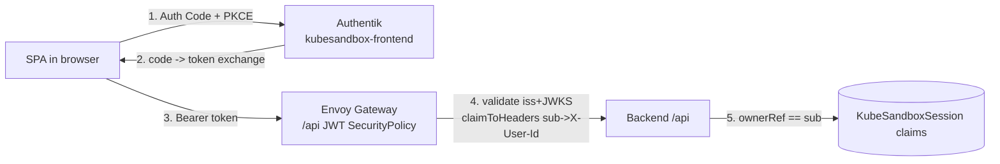
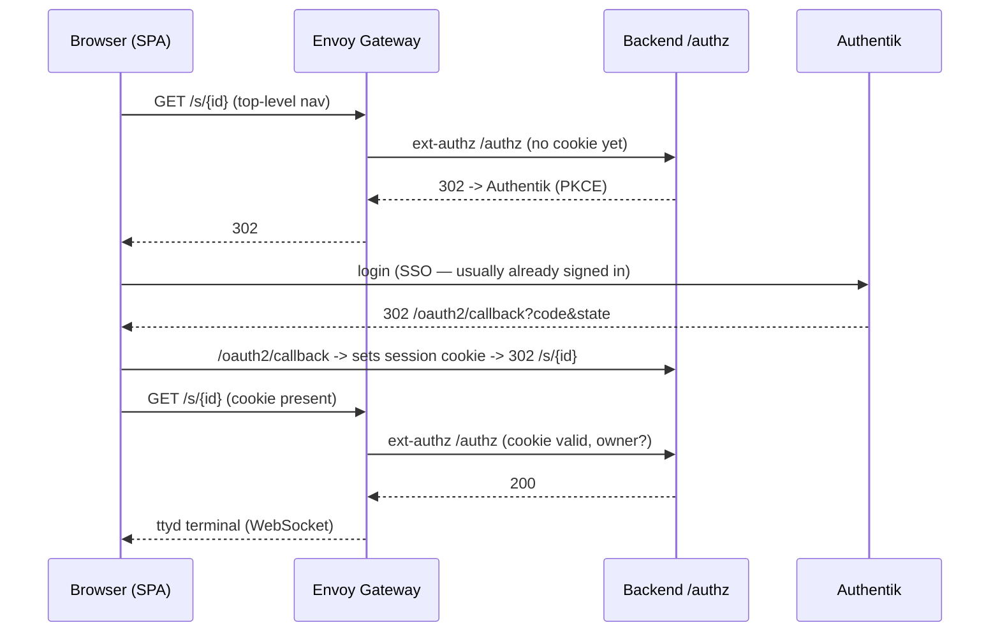
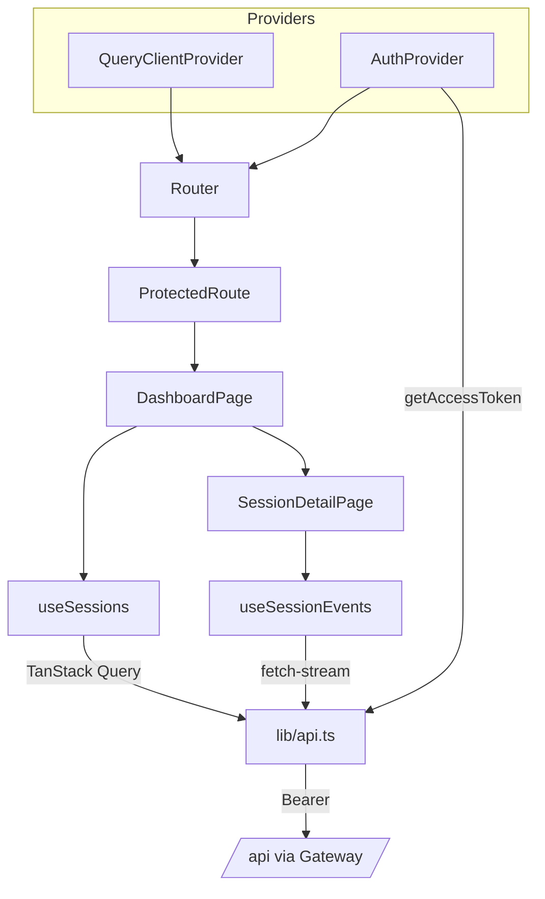

# KubeSandbox — Frontend Architecture

**Status:** design (proposed) — G5 not yet built
**Audience:** whoever builds the frontend SPA (incl. future me)
**Last updated:** 2026-07-01
**Related:** [`01-backend-architecture.md`](./01-backend-architecture.md) · [`02-auth-design.md`](./02-auth-design.md) · [`03-implementation-plan.md`](./03-implementation-plan.md) · [`04-backend-handoff.md`](./04-backend-handoff.md)
**Design system:** [`../.github/agents/design-principles.md`](../.github/agents/design-principles.md)

---

## 1. Scope & goals

The frontend is **G5** — the last unbuilt gap. The backend (G1/G2) is live on
prod-k3s: `/api` is a JWT-bearer session control API, and `/s/{id}` terminal
routes are protected by a **backend-owned OIDC/PKCE flow** behind Envoy
ext-authz. The SPA's job is narrow and well-defined:

1. **Sign the user in** (Authentik OIDC).
2. **Session dashboard** — list the user's sessions, create new ones (profile +
   TTL), watch them go `Ready` live, delete them.
3. **Open terminal** — hand the user off to `{PublicBaseURL}/s/{id}` where ttyd
   lives.

### Goals

- **Thin client.** The claim is the source of truth; the SPA renders it and
  issues CRUD. No business logic that belongs in the backend.
- **Honor the auth contract.** `/api` requires `Authorization: Bearer <token>` —
  there is **no cookie fallback** for that route (handoff §4). Identity key is
  the Authentik `sub` (hashed uid), **not** email.
- **Real-time by default.** Sessions provision asynchronously (vcluster
  cold-boot ~4–5 min); the UI must stream status, not force refreshes.
- **Operable & boring to ship.** One static image behind the shared Envoy
  Gateway; config injected at runtime so one build promotes across environments.
- **Lean stack.** React 19 + Vite + TS + Tailwind + shadcn/ui + Zod +
  TanStack Query. Animation kept to light polish (anime.js).

### Non-goals

- No server-side rendering. It's a static SPA served by nginx.
- No token minting or session store in the frontend container (stateless static
  assets only). The backend already owns all server-side auth state.
- No embedding of the vcluster API or kubeconfig in the browser — users only
  ever reach ttyd.

---

## 2. Tech stack

| Concern | Choice | Why |
|---|---|---|
| Framework | **React 19** + **TypeScript** | Matches README tech stack; concurrent features for streaming UI. |
| Build/dev | **Vite** | Fast HMR, first-class TS, static output for nginx. |
| Styling | **Tailwind CSS** + **shadcn/ui** | Utility-first + copy-in component primitives (owned, not a dep tree). See design-principles §9. |
| Data/cache | **TanStack Query** | Server-state cache, retries, background refetch; pairs with SSE for live updates. |
| Realtime | **fetch-stream SSE reader** (not `EventSource`) | `EventSource` can't set `Authorization` — must stream with a `fetch` + `ReadableStream` client (handoff §4.2). |
| Validation | **Zod** | Runtime-validate `/api` responses at the boundary; derive TS types from schemas. |
| Auth | **oidc-client-ts** (Auth Code + PKCE) | Standards-based browser OIDC, PKCE, silent renew; public client, no secret in the browser. |
| Routing | **react-router-dom** | Client-side routes, guarded routes, callback handling. |
| Motion | **anime.js** | Light polish only (status transitions, list enter/leave). |

> **Deliberately excluded** (available in `useful-repos-for-frontend/`, deferred
> to a later polish pass): react-three-fiber, ShaderGradient, liquid-glass /
> liquid-logo. The lean build ships first; immersive visuals are additive.

---

## 3. Route map & pages

The SPA owns these client routes. The gateway serves everything under `/`
(public) except the backend-owned `/api`, `/s/{id}`, and `/oauth2/callback`.

```
/                     Landing / sign-in            (public)
/auth/callback        OIDC redirect handler        (public; completes PKCE)
/dashboard            Session list + create        (guarded)
/dashboard/:id        Session detail (live status) (guarded)
/terminal/:id         Terminal hand-off page       (guarded; opens /s/{id})
*                     Not found
```

| Route | Page | Responsibility |
|---|---|---|
| `/` | `LandingPage` | Value prop + "Sign in". Kicks off PKCE via `oidc-client-ts`. If already authenticated, redirect to `/dashboard`. |
| `/auth/callback` | `CallbackPage` | Handles the `?code=&state=` return, completes token exchange, stores the user in memory, redirects to the intended route. |
| `/dashboard` | `DashboardPage` | Lists sessions (`GET /api/sessions`), shows the create dialog, per-session status badges, delete. |
| `/dashboard/:id` | `SessionDetailPage` | Single session, live SSE stream, resource/TTL/profile detail, "Open terminal" when `workspaceReady`. |
| `/terminal/:id` | `TerminalPage` | Hand-off: top-level navigate (or new tab) to `{VITE_PUBLIC_BASE_URL}/s/{id}`. See §4.4 for why not an iframe. |
| `*` | `NotFoundPage` | 404. |

> **Route note vs. the Helm chart.** The chart (`values.yaml`) currently marks
> `/terminal` as an OIDC-**protected** path with its own Envoy SecurityPolicy.
> In this design the terminal is **not** served by the frontend — it's the
> backend's `/s/{id}` route. `/terminal/:id` here is just a client-side
> hand-off page under the public SPA bundle. See §8 action items — the chart's
> `protectedPaths`/SecurityPolicy for `/terminal` should be dropped or repurposed.

---

## 4. Data + auth layer

This is the heart of the design, because the two backend surfaces authenticate
**differently**:

- `/api/*` — **JWT bearer** validated by an Envoy JWT `SecurityPolicy`.
- `/s/{id}` — **cookie** minted by the backend's own OIDC/PKCE flow via ext-authz.

The SPA touches both. They are handled separately.

### 4.1 Recommended token strategy for `/api` — SPA PKCE, backend-trusted issuer

**Recommendation:** the SPA runs its **own Authorization Code + PKCE flow**
against Authentik using the **public `kubesandbox-frontend` client**, holds the
access/ID token **in memory**, and attaches it as `Authorization: Bearer` to
every `/api` request and the SSE fetch-stream. To make those tokens acceptable
to `/api`, **add the frontend provider as a second JWT provider** (issuer +
JWKS) on `securitypolicy-api.yaml`.



**Why this is the right call here:**

- **It matches the contract the backend already enforces.** Handoff §4 and
  auth-design §3.1 state plainly: `/api` is JWT bearer, no cookie fallback, and
  "the frontend must attach a token to every `/api` call." This design does
  exactly that.
- **It keeps the backend stateless.** The architecture's scaling story
  (arch §10) depends on state living in claims + HMAC-signed cookies — no
  server-side session store. A BFF (see §4.2) would reintroduce a stateful hop.
- **No secret in the browser.** A public client + PKCE is the correct SPA
  posture; there is no `client_secret` to leak.
- **Identity stays consistent end-to-end.** Authentik's `sub_mode:
  hashed_user_id` makes `sub` a **per-user** value (the uid hash), identical
  across providers. So the `sub` in the SPA's bearer == the `ownerRef` the
  backend stores on claims == the `sub` in the `/s/{id}` session cookie.
  Ownership checks line up on `/api` and `/authz` without translation.

**The one required backend change:** the `/api` JWT `SecurityPolicy`
(`securitypolicy-api.yaml`) currently trusts **only** the `kubesandbox-backend`
provider's issuer/JWKS. A token minted for the `kubesandbox-frontend` client has
a different `iss` and will 401. Envoy Gateway's JWT policy supports **multiple
`providers`** — add the frontend issuer + JWKS endpoint:

```
issuer:  https://auth.jeremymr.dev/application/o/kubesandbox-frontend/
jwksUri: https://auth.jeremymr.dev/application/o/kubesandbox-frontend/jwks/
```

Keep `claimToHeaders` (`sub → X-User-Id`, …) on both providers so the backend's
`IdentityMiddleware` sees `X-User-Id` regardless of which client issued the
token. (Alternative: single provider + `audiences` check with the frontend
client added as an allowed audience on the backend provider — but multi-provider
is the cleaner Envoy-native path and needs no Authentik audience wiring.)

### 4.2 Alternative considered — Edge OIDC + BFF proxy (rejected)

Keep Envoy's edge OIDC (cookies) on the frontend routes, and add a small
**backend-for-frontend** that trades the cookie/session for a bearer and proxies
`/api`. Token never touches the browser; no JWT-policy change.

**Rejected because:** it adds a stateful proxy component, **duplicates auth the
backend already performs** for `/s/{id}`, and breaks the "stateless backend,
state in claims" principle the scaling model relies on. The cost (an extra hop
+ a new deployable + session affinity concerns) outweighs the benefit at this
scale. In-memory tokens + PKCE + short-lived access tokens with silent renew is
an acceptable, standard SPA security posture. Revisit only if a hard requirement
lands that tokens must never reach the browser.

### 4.3 SSE — fetch-stream, not `EventSource`

`GET /api/sessions/:id/events` emits SSE (`event: update|deleted|error`,
`data: <Session JSON>`, plus `: ping` heartbeats every 25s). Browser
`EventSource` **cannot set request headers**, so it can't carry the bearer.

The client reads SSE with **`fetch` + `ReadableStream`**, setting
`Authorization: Bearer`, and parses the `event:`/`data:` frames manually:

```ts
const res = await fetch(`${API_BASE}/sessions/${id}/events`, {
  headers: { Authorization: `Bearer ${await getToken()}` },
  signal,
});
// read res.body.getReader(), split on \n\n, dispatch update/deleted/error
```

TanStack Query holds the cached `Session`; the SSE reader pushes each `update`
into the cache via `queryClient.setQueryData`. **Fallback:** if the stream
errors or the browser can't stream, degrade to polling `GET /api/sessions/:id`
on an interval until `workspaceReady` (design-principles §7 — graceful
degradation).

### 4.4 Terminal hand-off — the backend owns this flow

`/s/{id}` is **not** an `/api` route and takes **no bearer**. It's protected by
the backend's own OIDC/PKCE + ext-authz (arch §7, auth §3.2). The SPA does
**not** implement any of that — it simply sends the browser to
`{VITE_PUBLIC_BASE_URL}/s/{id}`:



**Two consequences the SPA must respect:**

1. **Top-level navigation, not an iframe.** The first `/s/{id}` hit 302s to
   Authentik's login page, which sets `X-Frame-Options`/CSP framing headers and
   will be blocked inside an iframe. Open the terminal in a **new tab** (or a
   full-page same-tab navigation). Once the `kubesandbox_session` cookie exists,
   an iframe *could* work, but the login bounce cannot be framed — so default to
   a new tab. Embedding ttyd in-app is a later enhancement (pre-warm the cookie
   first).
2. **SSO makes the bounce invisible.** Because the user already authenticated
   with Authentik for the SPA's own login (§4.1), the `/s/{id}` login redirect
   round-trips through Authentik's existing session silently — the user just
   sees ttyd. Gate the "Open terminal" button on `workspaceReady === true`.

### 4.5 API client contract

Typed client wrapping the endpoints (all Zod-validated at the boundary):

| Method | Endpoint | Body / returns |
|---|---|---|
| `POST` | `/api/sessions` | `{ profile, ttlMinutes?, workspaceImage?, starterLabRef? }` → `201 Session` |
| `GET` | `/api/sessions` | → `{ sessions: Session[] }` |
| `GET` | `/api/sessions/:id` | → `Session` |
| `DELETE` | `/api/sessions/:id` | → `204` |
| `GET` | `/api/sessions/:id/events` | SSE stream (fetch-stream) |

**Error mapping** (mirror the backend): `400 invalid_request` /
`400 invalid_profile`, `401` (missing/invalid bearer → trigger re-auth /
silent renew), `404 not_found` (unknown/unowned/malformed id — same code, no
existence leak), `429 quota_exceeded` (surface "you've hit your session cap"),
`5xx` (retry-with-backoff + toast). See design-principles §3/§4 for placement +
messaging.

`Session` shape (from `models.Session`): `id`, `name`, `namespace`,
`tenantRef`, `ownerRef`, `profile`, `ttlMinutes`, `workspaceImage`,
`starterLabRef?`, `resources{cpu,memory}`, `phase`, `message?`,
`workspaceReady`, `sessionNamespace?`, `expiresAt?`, `url?`, `createdAt?`.

**Profiles** (fixed; backend sets resources from profile): `starter`
(250m/256Mi), `standard` (500m/512Mi), `advanced` (1/1Gi). **TTL:** 15–1440,
default 60.

---

## 5. State management

Two state domains, kept separate:

- **Auth state** — `AuthProvider` (React context) wrapping `oidc-client-ts`
  `UserManager`. Exposes `user`, `isAuthenticated`, `login()`, `logout()`,
  `getAccessToken()` (with silent renew). Access token held **in memory**;
  avoid persisting tokens to `localStorage`. `ProtectedRoute` reads this.
- **Server state** — **TanStack Query**. Query keys: `['sessions']` (list),
  `['session', id]` (detail). Mutations: `createSession`, `deleteSession` with
  optimistic updates + invalidation (design-principles §2 optimistic UI). The
  SSE reader writes live updates into the `['session', id]` (and list) cache.

No global client-state library (Redux/Zustand) — component-local `useState` +
context + query cache is sufficient for this surface.



---

## 6. Component tree & project layout

Aligns with the README's `components / context / lib / pages` convention, plus
`hooks/`:

```
frontend/
├── Dockerfile              # multi-stage: node build -> nginx:alpine
├── nginx.conf             # :8080, /health/{livez,readyz}, SPA fallback
├── docker-entrypoint.sh   # writes /config.js from env at container start (§7)
├── index.html
├── package.json
├── tsconfig.json · tsconfig.node.json
├── vite.config.ts
├── tailwind.config.js · postcss.config.js
├── .env.example
└── src/
    ├── main.tsx            # providers + router mount
    ├── App.tsx             # route table
    ├── routes.tsx
    ├── index.css           # tailwind layers
    ├── config.ts           # runtime config (window.__ENV -> import.meta.env)
    ├── lib/
    │   ├── api.ts          # typed client, bearer, SSE fetch-stream
    │   ├── auth.ts         # oidc-client-ts UserManager (PKCE)
    │   ├── schemas.ts      # Zod: Session, CreateSessionRequest, Profile
    │   ├── queryClient.ts
    │   └── utils.ts        # cn() for shadcn
    ├── context/
    │   └── AuthProvider.tsx
    ├── hooks/
    │   ├── useAuth.ts
    │   ├── useSessions.ts       # list/get/create/delete (TanStack Query)
    │   └── useSessionEvents.ts  # SSE subscription -> query cache
    ├── components/
    │   ├── ui/             # shadcn primitives (button, card, dialog, badge…)
    │   ├── Layout.tsx
    │   ├── ProtectedRoute.tsx
    │   ├── SessionCard.tsx
    │   ├── StatusBadge.tsx        # phase/workspaceReady -> color + label
    │   ├── ProfilePicker.tsx      # starter/standard/advanced
    │   └── CreateSessionDialog.tsx
    └── pages/
        ├── LandingPage.tsx
        ├── CallbackPage.tsx
        ├── DashboardPage.tsx
        ├── SessionDetailPage.tsx
        ├── TerminalPage.tsx
        └── NotFoundPage.tsx
```

**UX states per screen** (design-principles §1, §6): every data view implements
loading (skeletons), empty (first-run "create your first sandbox" CTA), error
(inline + toast), and partial (session provisioning) states. Provisioning uses a
progress affordance since it exceeds the 1s+ threshold (§2) — vcluster cold-boot
is minutes, so show phase + elapsed time, not an indefinite spinner.

---

## 7. Runtime configuration (important)

Vite inlines `import.meta.env.VITE_*` **at build time**. The Helm chart injects
`env:` into the **running** container — which does nothing to an
already-built static bundle. To make the chart's `env:` actually take effect
(and to promote one image across environments), use a **runtime config shim**:

- `docker-entrypoint.sh` writes `/usr/share/nginx/html/config.js` at container
  start from environment variables:
  `window.__ENV = { VITE_API_BASE: "…", VITE_OIDC_ISSUER: "…", … }`.
- `index.html` loads `/config.js` before the bundle.
- `src/config.ts` reads `window.__ENV?.X ?? import.meta.env.VITE_X ?? default`.

Runtime config keys:

| Key | Meaning | Example |
|---|---|---|
| `VITE_API_BASE` | Base path for the control API | `/api` |
| `VITE_PUBLIC_BASE_URL` | Origin for terminal hand-off | `https://kubesandbox.com` |
| `VITE_OIDC_ISSUER` | Frontend provider issuer | `https://auth.jeremymr.dev/application/o/kubesandbox-frontend/` |
| `VITE_OIDC_CLIENT_ID` | Public client id | `kubesandbox-frontend` |
| `VITE_OIDC_REDIRECT_URI` | PKCE redirect | `https://kubesandbox.com/auth/callback` |

> **Chart bug to fix:** `values.yaml` sets `VITE_API_BASE: "/api/v1"`, but the
> backend serves `/api` (router.go), not `/api/v1`. Left as-is the SPA calls a
> path the gateway doesn't route. Fix the value to `/api` (see §8).

---

## 8. Build & deploy

**Container.** Multi-stage: `node:22-alpine` builds the Vite bundle →
`nginx:alpine` serves it on **port 8080** with:

- `/health/livez` and `/health/readyz` → `200` (chart probes expect these).
- SPA fallback: unknown paths → `index.html` (client routing).
- nginx does **not** proxy `/api` or `/s/{id}` — the shared Envoy Gateway routes
  those to the backend directly.

**CI.** `.github/workflows/frontend.yml` already builds `./frontend` with
`./frontend/Dockerfile` and pushes `jurassicjey/kubesandbox-frontend:{latest,sha}`
on changes under `frontend/**`. The scaffold matches that path/Dockerfile
contract — no workflow change needed.

**Helm.** Chart `kubesandbox-charts/frontend` **v0.1.8** (the version that no
longer claims `/api`; do **not** regress to 0.1.7 — handoff §4.3). Public
HTTPRoute serves `/`, `/assets`, health; the frontend OIDC SecurityPolicy on
`/terminal` should be removed (terminal is backend-owned — §3, §8 items).

### Action items / open decisions

1. **Fix `VITE_API_BASE`** in `kubesandbox-charts/frontend/values.yaml`:
   `/api/v1` → `/api`.
2. **Trust the SPA's tokens on `/api`.** Add the `kubesandbox-frontend`
   provider (issuer + JWKS) to the `/api` JWT `SecurityPolicy`
   (`securitypolicy-api.yaml`), or add the frontend client as an allowed
   audience on the backend provider. Without this, valid SPA tokens 401 (§4.1).
3. **Verify G4 with a real bearer** (handoff §3): once the SPA can log in, run
   `curl -H "Authorization: Bearer <token>" https://kubesandbox.com/api/sessions`
   → `200` and confirm `X-User-*` reach the backend.
4. **Frontend Authentik client redirect URI** must equal
   `https://kubesandbox.com/auth/callback` (chart `authentication.oidc.redirectUrl`
   + the Terraform Workspace registration — strict match, auth §6.6).
5. **Repurpose/remove the `/terminal` protected route + SecurityPolicy** in the
   frontend chart — the terminal is `/s/{id}` on the backend, not a frontend
   route (§3).
6. **Confirm phase vocabulary.** The backend defaults `phase` to `Pending`;
   other values come from the Crossplane `function-auto-ready` pipeline. Gate
   "Open terminal" on `workspaceReady`, treat `phase` as a display label, and
   confirm the exact enum against a live claim before hard-coding badge colors.
7. **Cookie lifetime vs. TTL** (auth §6.4): session cookie default is 8h; if
   long-TTL sessions (up to 1440 min) are supported, the terminal may re-auth
   mid-session — acceptable (silent SSO), but note it in the UI copy.

---

## 9. Definition of done (frontend slice of plan §5 / handoff §6)

A user opens `kubesandbox.com`, signs in via Authentik, sees their (initially
empty) dashboard, creates a `standard` session, watches it stream from
`Pending` → provisioning → `Ready` **without refreshing**, clicks **Open
terminal**, and lands in a working `kubectl`-enabled ttyd against their private
vcluster — and never sees anyone else's session. Deleting a session removes it
from the list optimistically and tears down the sandbox.
