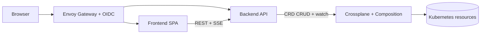

# KubeSandbox Frontend Architecture

This document defines the new frontend from a clean state. It intentionally ignores the deleted legacy UI and describes what the frontend should do, how it should be structured, and how it should interact with the backend.

## Project Mission

KubeSandbox is intended to be an on-demand Kubernetes playground platform.

The product should let a user:

- sign in through the web experience
- create a temporary sandbox session
- watch that session provision in real time
- launch a live workspace when it is ready
- access kubeconfig when needed
- rely on automatic cleanup when the session expires

The frontend is the user-facing layer of that platform. It should make the sandbox feel simple and fast, while the backend and Crossplane handle the actual orchestration.

## Purpose

The frontend is the user-facing control plane for KubeSandbox.

It exists to:

- present the product and guide users into the sandbox experience
- authenticate users indirectly through Envoy Gateway and OIDC
- create and manage sandbox sessions through the backend API
- surface session status, readiness, and kubeconfig access
- launch or link users into the live workspace once a session is ready

The frontend must not talk to Kubernetes directly. It should only communicate with the backend over HTTP and SSE.

## High-Level Architecture

## Frontend Responsibilities

The frontend should own the following concerns:

- public landing experience
- authenticated app shell and navigation
- session creation flow
- session dashboard and detail views
- live session status updates
- kubeconfig download initiation
- workspace launch entrypoint
- user identity display
- logout and auth transition pages

The frontend should not own:

- Kubernetes resource creation
- Crossplane composition logic
- TTL enforcement
- ownership rules
- session reconciliation logic
- kubeconfig generation

Those are backend and platform concerns.

## Architectural Principles

### 1. Backend is the source of truth

The frontend should always render backend state, not guess state locally.

Examples:

- session list comes from `GET /api/v1/sessions`
- session detail comes from `GET /api/v1/sessions/{name}`
- current user comes from `GET /api/v1/user`
- live updates come from `GET /api/v1/sessions/events`

### 2. Keep the browser thin

The browser should only manage:

- form state
- route state
- modal state
- UI preferences
- temporary loading and error states

### 3. Trust Envoy for auth

The frontend does not implement OIDC itself.

Envoy Gateway handles:

- login redirects
- callback handling
- logout routing
- header injection to the backend

The frontend only reacts to the authenticated user data exposed by the backend.

### 4. Use clean API boundaries

The frontend should use a small typed API client layer instead of calling `fetch` ad hoc from components.

That client should handle:

- JSON parsing
- non-2xx error normalization
- auth-related redirects if needed
- SSE connection setup and teardown

## Suggested Route Map

### Public Routes

`/`

- public landing page
- explains KubeSandbox
- shows value proposition
- primary CTA to enter the app
- can optionally show a sign-in or start-session CTA depending on auth state

`/auth/callback`

- transient route used during OIDC callback completion
- shows a loading state briefly
- can normalize the URL and return the user to the app

### Authenticated Routes

`/app` or `/dashboard`

- main authenticated landing page
- shows current user
- shows session summary and recent activity
- can show quick actions like create session, refresh, logout

`/sessions`

- list view for all sessions belonging to the current user
- main operational page
- supports filtering, sorting, and status chips

`/sessions/new`

- session creation form
- gathers tenant, profile, TTL, workspace image, and resource shape
- submits to backend

`/sessions/:name`

- session detail page
- shows lifecycle information and metadata
- provides actions to open workspace, download kubeconfig, and delete session

`/sessions/:name/workspace`

- live workspace launch page
- can embed the shell route in an iframe if allowed, or provide a launch button
- should make it obvious that the workspace is ephemeral and session-scoped

`/settings`

- optional user preferences page
- default TTL, default profile, theme, behavior toggles

`/error`

- generic error page for failed auth, missing session, or unrecoverable backend errors

## Page Responsibilities

### Landing Page

The landing page should:

- explain what the product does
- show the ephemeral sandbox model
- make the next action obvious
- optionally show a preview of the terminal or session lifecycle

It should not expose internal platform complexity.

### Auth Callback Page

The callback page should:

- render a very small progress state
- avoid user interaction
- wait for the gateway-auth flow to settle
- return the user to the intended destination

### Dashboard Page

The dashboard should:

- show the current user identity
- show total active sessions
- show session readiness at a glance
- surface recent changes and events
- provide a prominent create-session action

This is the page most users will return to often.

### Session List Page

The session list should:

- render all sessions for the current user
- show state, name, tenant, profile, TTL, and readiness
- allow click-through to details
- support live refresh when SSE reports changes

### Create Session Page

The create-session page should:

- validate required fields before submit
- allow sensible defaults
- present profile choices clearly
- let users override resources only when needed
- submit the form and then redirect to the session detail page

The frontend should not decide actual provisioning logic. It only collects input.

### Session Detail Page

The session detail page should:

- show status and phase
- show created time, expiry, namespace, and workspace metadata
- show human-readable messages from the backend
- show whether the workspace is ready
- expose actions:
  - launch workspace
  - copy or download kubeconfig
  - delete session
  - refresh status

This page is the best place to explain the lifecycle of a single sandbox.

### Workspace Page

The workspace page should:

- provide the direct entry point into the user’s shell environment
- make the session context obvious
- show a fallback if the workspace is not ready yet
- optionally embed a shell URL if the platform allows it safely

If embedding is not feasible, the page should still work as a launch-and-status page.

### Settings Page

Optional, but useful for future polish.

Could include:

- default profile
- default TTL
- preferred workspace image
- logout
- appearance preferences

## Backend API Contract

The frontend should consume these backend endpoints:

### User

- `GET /api/v1/user`

Returns the authenticated identity and groups.

### Sessions

- `GET /api/v1/sessions`
- `POST /api/v1/sessions`
- `GET /api/v1/sessions/{name}`
- `DELETE /api/v1/sessions/{name}`
- `GET /api/v1/sessions/{name}/kubeconfig`

### Realtime Updates

- `GET /api/v1/sessions/events`

Use Server-Sent Events to keep the UI live without polling.

### Health

- `GET /health`

Useful for shell-level diagnostics and deployment checks, but usually not a UI concern.

## Data Flow

### App Startup

1. Browser loads the frontend.
2. Frontend calls `GET /api/v1/user`.
3. If authenticated, the app loads user state.
4. Frontend fetches the session list.
5. Frontend opens an SSE connection for session events.

### Create Session

1. User fills in the create form.
2. Frontend validates required fields.
3. Frontend sends `POST /api/v1/sessions`.
4. Backend creates the session claim.
5. Crossplane provisions the session stack.
6. Frontend redirects to the session detail page.
7. Frontend updates live via SSE or periodic refresh.

### Session Readiness

1. Backend reflects Crossplane status in the session CRD.
2. Frontend receives updated state from `GET /api/v1/sessions/{name}` or SSE.
3. UI changes from provisioning to ready.
4. User can launch the workspace or download kubeconfig.

### Session Deletion

1. User confirms delete.
2. Frontend calls `DELETE /api/v1/sessions/{name}`.
3. Backend deletes the claim.
4. Crossplane tears down the composed resources.
5. Frontend removes the session from the list or redirects away.

## Frontend State Model

The frontend should have a small number of global state domains:

- `auth`
  - current user
  - authentication status
  - logout action

- `sessions`
  - list of sessions
  - selected session
  - loading and error states
  - live updates

- `ui`
  - toast notifications
  - modal state
  - nav state
  - theme preference

- `forms`
  - create session form state
  - validation errors

## Suggested Component Structure

### App Shell

- top navigation
- route outlet
- global toasts
- loading and error boundaries

### Feature Components

- `LandingHero`
- `FeatureGrid`
- `UserMenu`
- `SessionTable`
- `SessionStatusPill`
- `SessionDetailHeader`
- `CreateSessionForm`
- `KubeconfigPanel`
- `WorkspaceLauncher`
- `EmptyState`
- `ErrorState`

### UI Primitives

- buttons
- cards
- pills
- inputs
- selects
- tabs
- dialogs
- skeleton loaders

## Realtime Strategy

The frontend should use SSE for live session updates rather than aggressive polling.

Recommended behavior:

- open one SSE stream after auth is established
- listen for session lifecycle events
- refresh list/detail state when relevant events arrive
- reconnect automatically if the stream drops
- fall back to manual refresh if SSE fails

## Error Handling Strategy

The frontend should handle errors at three levels:

### Field Level

- missing name
- invalid TTL
- invalid resource values

### Page Level

- session not found
- forbidden
- backend unavailable
- authentication missing

### Global Level

- connection lost
- failed to load user state
- failed to connect to SSE

The UI should fail gracefully and keep the user oriented.

## Auth and Logout Behavior

The frontend should not try to own the login protocol.

Recommended pattern:

- login action navigates to a protected route or gateway login entrypoint
- logout action sends the browser to the gateway logout path
- authenticated identity comes from the backend
- no sensitive identity data should be trusted from local storage as the source of truth

## UX Direction

The UI should feel like a real operations product, not a generic admin panel.

Guidelines:

- make session state visible and understandable
- use clear status colors and readable timestamps
- keep primary actions obvious
- make workspace launch feel immediate
- avoid clutter on the landing page
- keep authenticated pages dense but organized

## Out of Scope

The frontend should not:

- directly read Kubernetes secrets
- construct CRDs
- implement TTL cleanup
- depend on Crossplane provider internals
- embed business rules that belong in the backend

## Recommended Build Approach

If implemented next, the frontend should probably be built as:

- React + TypeScript
- Vite or equivalent fast bundler
- client-side routing
- a small API client layer
- SSE support
- a clean design system with shared tokens

## Summary

The frontend is the user experience layer for KubeSandbox. Its job is to help users understand the platform, create sessions, monitor them, and jump into the workspace. The backend remains the authority for identity, session lifecycle, and Crossplane-backed infrastructure.

The cleanest frontend architecture is:

- public landing plus auth callback
- authenticated dashboard and session views
- create-session flow
- live session updates through SSE
- workspace launch and kubeconfig access
- no direct Kubernetes logic in the browser
