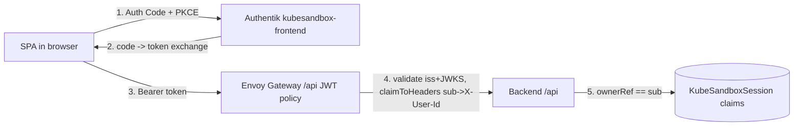

# KubeSandbox — Frontend Architecture

**Status:** living design (updated 2026-07-02 — G5 built and live on prod-k3s)
**Audience:** whoever maintains the frontend SPA
**Related:** [`backend-architecture.md`](./backend-architecture.md) · [`auth-design.md`](./auth-design.md) · [`hot-pool-design.md`](./hot-pool-design.md)
**Design system:** [`../../.github/agents/design-principles.md`](../../.github/agents/design-principles.md)

---

## 1. Scope & goals

The frontend is **G5** and is now live. The backend (G1–G3) is live on prod-k3s:
`/api` is a JWT-bearer control API backed by a **hot warm-pool**, and `/s/{id}`
terminal routes are protected by a **backend-owned OIDC/PKCE flow** behind Envoy
ext-authz. The SPA's job is narrow:

1. **Sign the user in** (Authentik OIDC, public client + PKCE).
2. **Sandbox dashboard** — show the user's single sandbox (one per user), create
   it (the only knob is TTL), watch it go `Ready` live, delete it.
3. **Queue** — when the pool is momentarily full, `POST /sessions` returns `202`;
   the dashboard shows the caller's place in line and swaps in the sandbox the
   instant one is assigned.
4. **Open terminal** — embed `{PublicBaseURL}/s/{id}` in-page when same-origin,
   otherwise hand off to a new tab.

### Goals

- **Thin client.** The claim is the source of truth; the SPA renders it and
  issues CRUD. No business logic that belongs in the backend.
- **Honor the auth contract.** `/api` requires `Authorization: Bearer <token>` —
  there is **no cookie fallback** for that route. Identity key is the Authentik
  `sub` (hashed uid), **not** email.
- **Real-time by default.** Sandboxes and queue positions stream over SSE; the UI
  never forces a refresh, and degrades to polling if a stream drops.
- **Operable & boring to ship.** One static image behind the shared Envoy
  Gateway; config injected at runtime so one build promotes across environments.
- **Lean stack.** React 19 + Vite + TS + Tailwind + shadcn-style UI + Zod +
  TanStack Query. Animation kept to light polish (anime.js).

### Non-goals

- No server-side rendering. It's a static SPA served by nginx.
- No token minting or session store in the frontend container (static assets
  only). The backend already owns all server-side auth state.
- No embedding of the vcluster API or kubeconfig in the browser — users only ever
  reach ttyd.

---

## 2. Tech stack

| Concern | Choice | Why |
|---|---|---|
| Framework | **React 19** + **TypeScript** | Concurrent features for streaming UI. |
| Build/dev | **Vite** | Fast HMR, first-class TS, static output for nginx. |
| Styling | **Tailwind CSS** + shadcn-style primitives | Utility-first + copy-in components (owned, not a dep tree). |
| Data/cache | **TanStack Query** | Server-state cache, retries, background refetch; pairs with SSE for live updates. |
| Realtime | **fetch-stream SSE reader** (not `EventSource`) | `EventSource` can't set `Authorization` — must stream with `fetch` + `ReadableStream` (§4.3). |
| Validation | **Zod** | Runtime-validate `/api` responses at the boundary; derive TS types from schemas. |
| Auth | **oidc-client-ts** (Auth Code + PKCE) | Standards-based browser OIDC; public client, no secret; refresh-token renewal (§4.1). |
| Routing | **react-router-dom** | Client-side routes, guarded routes, callback handling. |
| Motion | **anime.js** | Light polish only. |

---

## 3. Route map & pages

The SPA owns these client routes. The gateway serves everything under `/`
(public) except the backend-owned `/api`, `/s/{id}`, and `/oauth2/callback`.

```
/                     Landing / sign-in            (public)
/auth/callback        OIDC redirect handler        (public; completes PKCE)
/dashboard            Sandbox + queue              (guarded)
/terminal/:id         Terminal hand-off page       (guarded; embeds or opens /s/{id})
*                     Not found
```

| Route | Page | Responsibility |
|---|---|---|
| `/` | `LandingPage` | Value prop + "Sign in". Kicks off PKCE. If already authenticated, redirect to `/dashboard`. |
| `/auth/callback` | `CallbackPage` | Handles the `?code=&state=` return, completes token exchange, stores the user (sessionStorage, §4.1), redirects to the intended route. |
| `/dashboard` | `DashboardPage` | The single sandbox card **or** the queue card; create dialog; live status; delete. One page covers list, create, queue, and detail. |
| `/terminal/:id` | `TerminalPage` | Embeds the terminal (`TerminalFrame`) when same-origin, else hands off to `{VITE_PUBLIC_BASE_URL}/s/{id}` in a new tab (§4.4). |
| `*` | `NotFoundPage` | 404. |

> There is **no** `/dashboard/:id` detail route or `SessionDetailPage` — because a
> user has at most one sandbox, the dashboard *is* the detail view.

---

## 4. Data + auth layer

The two backend surfaces authenticate **differently**:

- `/api/*` — **JWT bearer** validated by an Envoy JWT `SecurityPolicy`.
- `/s/{id}` — **cookie** minted by the backend's own OIDC/PKCE flow via ext-authz.

The SPA touches both, handled separately.

### 4.1 Token strategy for `/api` — SPA PKCE, backend-trusted issuer

The SPA runs its **own Authorization Code + PKCE flow** against Authentik using
the **public `kubesandbox-frontend` client**, stores the OIDC user (tokens incl.
the refresh token) in **`sessionStorage`** (per-tab, cleared on tab close, never
`localStorage`), and attaches the access token as `Authorization: Bearer` to every
`/api` request and SSE fetch-stream. Renewal uses **refresh tokens**
(`offline_access` scope) via a direct token-endpoint fetch. The `/api` JWT
`SecurityPolicy` trusts the frontend provider (issuer + JWKS) as an additional
provider, so these tokens are accepted (see [`auth-design.md`](./auth-design.md) §3.1).



> **Why `sessionStorage` + refresh tokens, not memory-only.** The original design
> held tokens in memory and relied on iframe silent renew against the Authentik
> SSO session. That is structurally broken cross-site: the SPA
> (`kubesandbox.com`) and Authentik (`auth.jeremymr.dev`) are different sites, so
> the `SameSite=Lax` session cookie is never sent inside the hidden iframe and
> `prompt=none` always returned `login_required` — every refresh logged the user
> out. `sessionStorage` + refresh tokens keeps "nothing long-lived in
> `localStorage`" while making reloads and renewals work with no cross-site cookie
> dependency. Requires the `offline_access` scope mapping on the Authentik
> provider. See `frontend/src/lib/auth.ts` for the implementation.

**Identity consistency.** Authentik's `sub_mode: hashed_user_id` makes `sub` a
per-user value identical across providers. So the `sub` in the SPA's bearer == the
`ownerRef` the backend stores on claims == the `sub` in the `/s/{id}` session
cookie. Ownership checks line up on `/api` and `/authz` without translation.

### 4.2 SSE — fetch-stream, not `EventSource`

Both `GET /api/sessions/:id/events` and `GET /api/queue/events` emit SSE
(`event:`/`data:` frames, plus `: ping` heartbeats every ~25s). Browser
`EventSource` **cannot set request headers**, so it can't carry the bearer. The
client reads SSE with a shared **`fetch` + `ReadableStream`** reader
(`streamSSE` in `lib/api.ts`), setting `Authorization: Bearer`, and parses frames
manually. The SSE readers push each event into the TanStack Query cache. **On any
stream error, both readers fall back to polling** (session detail / queue
position) so the UI never dies (design-principles §7).

### 4.3 Create → assign or queue

`POST /api/sessions` (body: `{ ttlMinutes? }`) returns one of two shapes, modelled
as a discriminated `CreateSessionResult`:

- **`201 Created`** → a warm sandbox was assigned immediately. `useCreateSession`
  seeds both the `['session', id]` and list caches so the card renders instantly.
- **`202 Accepted`** → the pool was full; body is a `QueueStatus` with a 1-based
  position. The status is written to the `['queue']` cache and
  `useQueueWatcher` (mounted on the dashboard) takes over: it follows
  `/api/queue/events`, updates the position live, and on the terminal `assigned`
  event writes the session into cache and clears the queue — the dashboard swaps
  the queue card (`QueueCard`) for the sandbox card without a refetch. A page
  reload while queued restores the "in line" view via `GET /api/queue`.

### 4.4 Terminal hand-off

`/s/{id}` is **not** an `/api` route and takes **no bearer**. It's protected by the
backend's own OIDC/PKCE + ext-authz. The SPA does not implement any of that:

- **Same-origin** (terminal served from the SPA's own origin): embed it in-page
  with `TerminalFrame`, passing ttyd client options (theme/font) as query params
  via `embeddedTerminalUrl(id)` so the terminal matches the site palette. The
  canonical trailing-slash URL is used to avoid ttyd's `/s/{id}` → `/s/{id}/`
  redirect dropping the theme query.
- **Cross-origin** (`isTerminalEmbeddable()` false): the login bounce to Authentik
  can't be framed and can't be auth-probed cross-origin, so hand off to a **new
  tab** at `terminalUrl(id)`.

Because the user already authenticated with Authentik for the SPA login, the
`/s/{id}` login redirect round-trips through Authentik's existing SSO session
silently. Gate the terminal on `workspaceReady === true`.

### 4.5 API client contract

Typed client (`lib/api.ts`), all Zod-validated at the boundary:

| Method | Endpoint | Body / returns |
|---|---|---|
| `POST` | `/api/sessions` | `{ ttlMinutes? }` → `201 Session` **or** `202 QueueStatus` |
| `GET` | `/api/sessions` | → `{ sessions: Session[] }` |
| `GET` | `/api/sessions/:id` | → `Session` |
| `DELETE` | `/api/sessions/:id` | → `204` |
| `GET` | `/api/sessions/:id/events` | SSE stream (fetch-stream) |
| `GET` | `/api/queue` | → `QueueStatus`, or `404` when not queued |
| `GET` | `/api/queue/events` | SSE stream: `queued` position updates → terminal `assigned`/`error` |

**Error mapping** (mirror the backend): `400 invalid_request`, `401`
(missing/invalid bearer → refresh-token renew / re-auth), `404 not_found`
(unknown/unowned/malformed id — same code, no existence leak),
`409 session_exists` (surface "you already have a sandbox" — one per user,
including one still tearing down), `5xx` (retry-with-backoff + toast).

`Session` shape (from `models.Session`): `id`, `name`, `namespace`, `tenantRef`,
`ownerRef`, `ttlMinutes`, `workspaceImage`, `starterLabRef?`,
`resources{cpu,memory}`, `phase`, `message?`, `workspaceReady`,
`sessionNamespace?`, `expiresAt?`, `url?`, `createdAt?`.

> **No profiles.** Every sandbox is identical (`500m` / `512Mi`, display-only in
> `SANDBOX_RESOURCES`). The only create parameter is `ttlMinutes` (15–1440,
> default 60). The `starter/standard/advanced` profile picker was removed when the
> hot pool made sandboxes fungible.

---

## 5. State management

Two state domains, kept separate:

- **Auth state** — `AuthProvider` (React context) wrapping `oidc-client-ts`
  `UserManager`. Exposes `user`, `isAuthenticated`, `login()`, `logout()`,
  `getAccessToken()` (renews via refresh token when expired). OIDC user stored in
  `sessionStorage`. `ProtectedRoute` reads this.
- **Server state** — **TanStack Query**. Keys: `['sessions']` (list),
  `['session', id]` (detail), `['queue']` (queue status). Mutations:
  `useCreateSession`, `useDeleteSession`. The SSE readers write live updates into
  these caches.

Two custom-state details worth knowing:

- **Optimistic delete with a pending set** (`useSessions`). The backend deletes
  asynchronously, so a refetch right after `DELETE` can still return the session
  and "resurrect" the card. `useSessions` tracks optimistically-deleted ids in an
  external store (`useSyncExternalStore`) and hides them from every render until a
  real server response stops returning them; on failure the id is cleared and the
  card rolls back.
- **Queue watcher keyed on a boolean** (`useQueueWatcher`). The effect keys on
  *whether* the user is queued, not the `QueueStatus` object — otherwise each
  position update would tear down and reopen the SSE stream.

No global client-state library — context + query cache is sufficient.

---

## 6. Component tree & project layout

```
frontend/
├── Dockerfile              # multi-stage: node build -> nginx
├── nginx.conf             # :8080, /health/{livez,readyz}, /config.js, SPA fallback
├── docker-entrypoint.sh   # writes /config.js from env at container start (§7)
├── index.html
├── package.json
├── vite.config.ts · tailwind.config.js · postcss.config.js
├── .env.example
└── src/
    ├── main.tsx            # providers + router mount
    ├── App.tsx             # route table
    ├── index.css           # tailwind layers + theme tokens
    ├── config.ts           # runtime config + terminal URL/theme helpers
    ├── lib/
    │   ├── api.ts          # typed client, bearer, SSE fetch-stream (session + queue)
    │   ├── auth.ts         # oidc-client-ts UserManager (PKCE, sessionStorage, refresh)
    │   ├── schemas.ts      # Zod: Session, CreateSessionRequest, QueueStatus
    │   ├── queryClient.ts  # query keys + client
    │   └── utils.ts        # cn()
    ├── context/
    │   └── AuthProvider.tsx
    ├── hooks/
    │   ├── useAuth.ts
    │   ├── useSessions.ts       # list/get/create/delete (+ optimistic delete)
    │   ├── useSessionEvents.ts  # session SSE -> query cache (+ poll fallback)
    │   └── useQueue.ts          # queue status + queue SSE watcher (+ poll fallback)
    ├── components/
    │   ├── ui/                  # card, button
    │   ├── Layout.tsx
    │   ├── ProtectedRoute.tsx
    │   ├── SessionCard.tsx
    │   ├── StatusBadge.tsx      # phase/workspaceReady -> color + label
    │   ├── QueueCard.tsx        # "you're in line", live position
    │   ├── CreateSessionDialog.tsx
    │   ├── ConfirmDeleteDialog.tsx
    │   └── TerminalFrame.tsx    # same-origin embedded ttyd
    └── pages/
        ├── LandingPage.tsx
        ├── CallbackPage.tsx
        ├── DashboardPage.tsx
        ├── TerminalPage.tsx
        └── NotFoundPage.tsx
```

**UX states per screen** (design-principles §1, §6): loading (skeletons), empty
(first-run "create your first sandbox" CTA), error (inline + toast), queued
(position + reassurance), and partial (provisioning) states. Because a warm member
is usually already `Ready`, the common case renders a working sandbox immediately;
the provisioning affordance covers the cold-path/queue case.

---

## 7. Runtime configuration

Vite inlines `import.meta.env.VITE_*` **at build time**. The Helm chart injects
`env:` into the **running** container, which does nothing to an already-built
bundle. So a **runtime config shim** makes one image promotable:

- `docker-entrypoint.sh` writes `/config.js` at container start:
  `window.__ENV = { VITE_API_BASE: "…", VITE_OIDC_ISSUER: "…", … }`.
- `index.html` loads `/config.js` before the bundle.
- `src/config.ts` resolves `window.__ENV?.X ?? import.meta.env.VITE_X ?? default`.

| Key | Meaning | Example |
|---|---|---|
| `VITE_API_BASE` | Base path for the control API | `/api` |
| `VITE_PUBLIC_BASE_URL` | Origin for terminal hand-off | `https://kubesandbox.com` |
| `VITE_OIDC_ISSUER` | Frontend provider issuer | `https://auth.jeremymr.dev/application/o/kubesandbox-frontend/` |
| `VITE_OIDC_CLIENT_ID` | Public client id | `kubesandbox-frontend` |
| `VITE_OIDC_REDIRECT_URI` | PKCE redirect | `https://kubesandbox.com/auth/callback` |

The chart's `VITE_API_BASE` is `/api` (matching `router.go`); the SPA also requests
the `offline_access` scope for refresh-token renewal.

---

## 8. Build & deploy

**Container.** Multi-stage build → nginx on **port 8080** with `/health/livez`,
`/health/readyz`, a `/config.js` location, `/assets` caching, and SPA fallback
(unknown paths → `index.html`). nginx does **not** proxy `/api` or `/s/{id}` — the
shared Envoy Gateway routes those to the backend.

**CI.** `.github/workflows/frontend.yml` builds `./frontend` and pushes
`jurassicjey/kubesandbox-frontend:{latest,sha}` on changes under `frontend/**`.

**Helm.** Chart `kubesandbox-charts/frontend`. Its HTTPRoute serves `/`,
`/assets`, and health as **public** paths (`protectedPaths: []`) — the SPA owns
its PKCE flow, so there is no Envoy edge OIDC on the frontend routes, and the
frontend `authentication` block stays disabled. `/api` is deliberately **not**
claimed here; the backend chart owns the `/api` HTTPRoute and its JWT policy. The
terminal is the backend's `/s/{id}`, not a frontend route.

---

## 9. Definition of done (met)

A user opens `kubesandbox.com`, signs in via Authentik, sees their (initially
empty) dashboard, creates a sandbox (choosing only a TTL), and either lands on a
`Ready` sandbox immediately or watches their queue position advance until one is
assigned — **without refreshing**. They open the terminal (embedded when
same-origin, else a new tab) into a working `kubectl`-enabled ttyd against their
private vcluster, and never see anyone else's session. Deleting removes the card
optimistically and tears down the sandbox.
